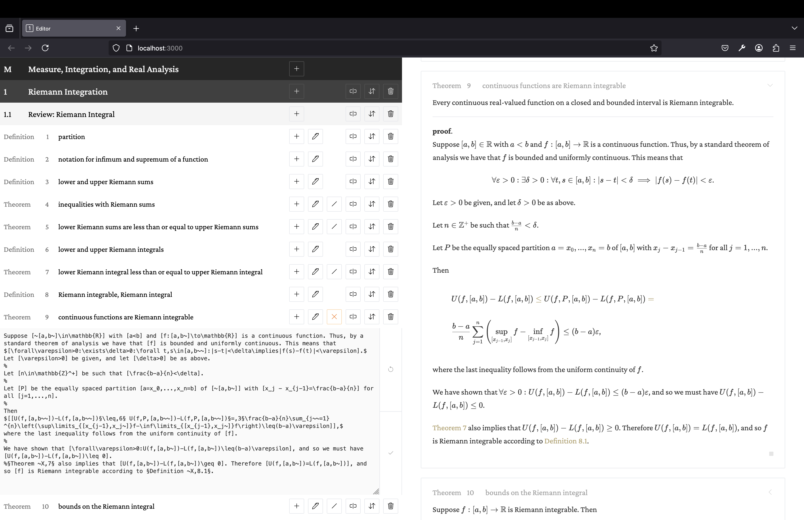

# Square 1 Editor

This is a custom LaTeX editor I've built to quickly write and maintain thoroughly cross-referenced math texts for the [Square 1](https://github.com/AlonLandmann/square-one-client) project.
It interacts with a local PostgreSQL instance.

